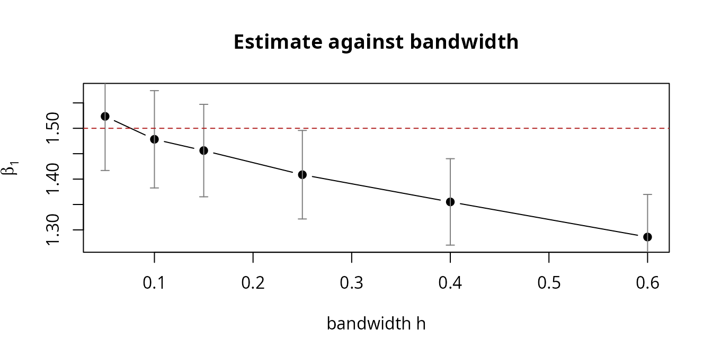
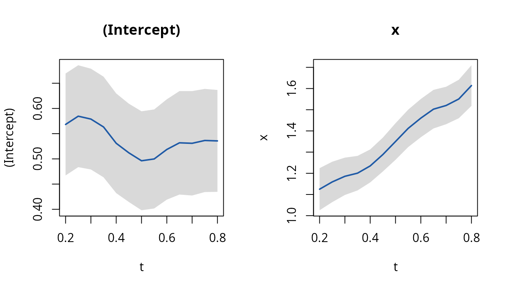

# Asynchronous Longitudinal Regression

``` r

library(skmle)
```

The two data frames come first in every call, so the estimators compose
with the native pipe. Examples below use it where it reads better.

## The problem

Suppose you want to know how a biomarker relates to a symptom score. The
biomarker is drawn at clinic visits; the symptom score is collected by a
questionnaire on its own schedule. Neither is measured often, and the
two schedules have nothing to do with each other. You have, per subject,

- a response process \\Y_i(\cdot)\\ observed at times \\T\_{i1}, \dots,
  T\_{iL_i}\\,
- a covariate process \\X_i(\cdot)\\ observed at times \\S\_{i1}, \dots,
  S\_{iM_i}\\,

and \\\\T\_{ij}\\\\ and \\\\S\_{ik}\\\\ never coincide. The model you
want is the ordinary one,

\\E\\Y_i(t) \mid X_i(t)\\ = g\\X_i(t)^\top \beta\\,\\

but \\Y_i\\ and \\X_i\\ are never observed at the same \\t\\, so not one
row of the data set is a complete observation of the regression you are
trying to fit.

This is the setting of Cao, Zeng and Fine (2015). The package implements
their two estimators:
[`kee_async()`](https://dayusun.github.io/skmle/reference/kee_async.md)
for a constant \\\beta\\, and
[`kee_async_td()`](https://dayusun.github.io/skmle/reference/kee_async_td.md)
for a coefficient curve \\\beta(t)\\.

## Two shortcuts that do not work

Before the estimator, it is worth being clear about why the obvious
fixes fail, because both are common in practice and both fail *silently*
— they return plausible numbers with plausible standard errors.

**Last value carried forward.** Replace \\X_i(T\_{ij})\\ by the most
recent observed covariate value. This is measurement error with a twist:
the error does not shrink as the sample grows. With sparse sampling the
expected gap back to the previous observation is a property of the visit
process, not of \\n\\, so the substituted covariate keeps a fixed error
variance forever. The result is classical attenuation — \\\hat\beta\\
converges, but to something closer to zero than \\\beta\\.

**Regression calibration.** Smooth the covariate path first, then
substitute the smoothed value. This feels more careful and has the same
problem: to smooth at \\T\_{ij}\\ you need observations near
\\T\_{ij}\\, and under sparse sampling the window cannot shrink without
emptying. Whatever bandwidth keeps the window occupied also keeps a
non-vanishing lag spread, and the attenuation returns. For a nonlinear
link there is a second error on top: the estimating equation needs the
average of \\g(\cdot)\\, and you have supplied \\g\\ of the average.

What the kernel-weighted equation does instead is give up on
reconstructing \\X_i(T\_{ij})\\ at all. It evaluates the link at each
**observed** covariate vector and lets a weight express how much that
observation says about that response occasion.

## The estimator

\\U_n(\beta) = n^{-1} \sum_i \sum_j \sum_k W_h(T\_{ij} - S\_{ik})\\
X_i(S\_{ik}) \left\[ Y_i(T\_{ij}) - g\\X_i(S\_{ik})^\top \beta\\
\right\] = 0,\\

with \\W_h(u) = W(u/h)/h\\ and \\W\\ the Epanechnikov kernel. Every
(response, covariate) pair within a subject contributes, weighted by how
far apart in time the two occasions are. Pairs more than \\h\\ apart
drop out; pairs close together dominate.

Two things follow that are easy to miss.

First, **the rate is \\(nh)^{1/2}\\, not \\\sqrt{n}\\.** This is a
smoothing problem wearing a regression problem’s clothes. Standard
errors shrink more slowly than you are used to, and the bandwidth is a
real modelling choice rather than a nuisance.

Second, **there is no requirement that time lie on \\\[0,1\]\\.** The
equation depends on times only through \\(T - S)/h\\, so any units work
— provided `h` is in the same units. That is the one thing to get right,
and the package warns when it looks wrong.

## A worked example

[`sim_async_data()`](https://dayusun.github.io/skmle/reference/sim_async_data.md)
generates the design from Section 4 of the paper: response and covariate
observation times are independent Poisson streams, and the covariate is
a Gaussian process.

``` r

set.seed(2024)
d <- sim_async_data(n = 400, beta = c(0.5, 1.5))

str(d$y)
#> tibble [1,985 × 3] (S3: tbl_df/tbl/data.frame)
#>  $ id  : int [1:1985] 1 1 1 1 1 1 1 2 2 2 ...
#>  $ time: num [1:1985] 0.303 0.416 0.457 0.68 0.698 ...
#>  $ y   : num [1:1985] 1.03 2.36 2.85 2.65 2.24 ...
str(d$x)
#> tibble [1,987 × 3] (S3: tbl_df/tbl/data.frame)
#>  $ id  : int [1:1987] 1 1 1 1 2 2 3 3 4 4 ...
#>  $ time: num [1:1987] 0.119 0.704 0.902 0.953 0.192 ...
#>  $ x   : num [1:1987] 0.5317 0.0115 -0.292 0.3258 -0.9327 ...
```

Two tables, sharing only `id`. There is no way to merge them without
inventing rows, which is precisely the point.

``` r

c(
  subjects = length(unique(d$y$id)),
  response_occasions = nrow(d$y),
  covariate_occasions = nrow(d$x),
  median_per_subject_y = median(table(d$y$id)),
  median_per_subject_x = median(table(d$x$id))
)
#>             subjects   response_occasions  covariate_occasions 
#>                  400                 1985                 1987 
#> median_per_subject_y median_per_subject_x 
#>                    5                    5
```

The formula spans both tables — left-hand side from `data_y`, right-hand
side from `data_x` — and `id` and `time` name columns present in each:

``` r

fit <- d$y |>
  kee_async(d$x, y ~ x, id = id, time = time, h = 0.25)

summary(fit)
#> Call:
#> kee_async(data_y = d$y, data_x = d$x, formula = y ~ x, id = id, 
#>     time = time, h = 0.25)
#> 
#> Asynchronous longitudinal regression (identity link, full kernel)
#>   n= 400 subjects   bandwidth h = 0.25
#> 
#>             Estimate Std. Error z value  Pr(>|z|)    
#> (Intercept) 0.441986   0.057943  7.6279 2.386e-14 ***
#> x           1.408638   0.044451 31.6897 < 2.2e-16 ***
#> ---
#> Signif. codes:  0 '***' 0.001 '**' 0.01 '*' 0.05 '.' 0.1 ' ' 1
#> 
#> Optimization status: 0
```

The truth is \\\beta = (0.5, 1.5)\\. `npair` records how many weighted
pairs actually contributed:

``` r

c(pairs = fit$npair, subjects = nobs(fit))
#>    pairs subjects 
#>     4324      400
```

Standard generics work as usual:

``` r

coef(fit)
#> (Intercept)           x 
#>   0.4419863   1.4086382
confint(fit)
#>                 2.5 %    97.5 %
#> (Intercept) 0.3284197 0.5555529
#> x           1.3215158 1.4957606
sqrt(diag(vcov(fit)))
#> (Intercept)           x 
#>  0.05794320  0.04445101
```

## Tidy output

[`tidy()`](https://generics.r-lib.org/reference/tidy.html),
[`glance()`](https://generics.r-lib.org/reference/glance.html) and
[`augment()`](https://generics.r-lib.org/reference/augment.html) return
tibbles, so a fit goes straight into the rest of a tidy workflow without
reshaping.

``` r

tidy(fit, conf.int = TRUE)
#> # A tibble: 2 × 7
#>   term        estimate std.error statistic   p.value conf.low conf.high
#>   <chr>          <dbl>     <dbl>     <dbl>     <dbl>    <dbl>     <dbl>
#> 1 (Intercept)    0.442    0.0579      7.63 2.39e- 14    0.328     0.556
#> 2 x              1.41     0.0445     31.7  2.16e-220    1.32      1.50

glance(fit)
#> # A tibble: 1 × 7
#>    nobs nterms     h npair link     one_sided convergence
#>   <int>  <int> <dbl> <int> <chr>    <lgl>           <int>
#> 1   400      2  0.25  4324 identity FALSE               0
```

[`augment()`](https://generics.r-lib.org/reference/augment.html)
attaches the fitted mean to the **covariate** table, because that is
where a fitted value lives here: the estimating equation evaluates the
link at each observed covariate vector, and it is the kernel weight, not
the fitted value, that connects it to a response occasion.

``` r

augment(fit, d$x)
#> # A tibble: 1,987 × 4
#>       id   time       x .fitted
#>    <int>  <dbl>   <dbl>   <dbl>
#>  1     1 0.119   0.532   1.19  
#>  2     1 0.704   0.0115  0.458 
#>  3     1 0.902  -0.292   0.0307
#>  4     1 0.953   0.326   0.901 
#>  5     2 0.192  -0.933  -0.872 
#>  6     2 0.456  -0.523  -0.294 
#>  7     3 0.0395 -0.480  -0.234 
#>  8     3 0.748  -0.366  -0.0731
#>  9     4 0.0143 -1.84   -2.15  
#> 10     4 0.0156 -1.86   -2.18  
#> # ℹ 1,977 more rows
```

There is deliberately no `.resid` column. A residual needs a response
value at \\S\_{ik}\\, which is exactly what asynchronous data does not
have; reporting one would mean inventing it. The fit does not retain its
data, so
[`augment()`](https://generics.r-lib.org/reference/augment.html) needs
`data_x` handed back to it.

## Choosing the bandwidth

Because the rate is \\(nh)^{1/2}\\, `h` trades variance against bias
directly: small `h` admits few pairs, large `h` admits pairs whose times
are far apart and so pulls in a bias.
[`kee_async_cv()`](https://dayusun.github.io/skmle/reference/kee_async_cv.md)
chooses it by cross-validation over **subjects**, scoring each candidate
by the kernel-weighted squared error on the held-out subjects.

``` r

cv <- d$y |>
  kee_async_cv(d$x, y ~ x,
    id = id, time = time,
    h_grid = c(0.05, 0.10, 0.15, 0.25, 0.40, 0.60),
    K = 5, seed = 1, quiet = TRUE
  )
#> Warning: the selected bandwidth is at an endpoint of 'h_grid'; widen the grid
#> to check that the minimum is interior
cv
#> Call:
#> kee_async_cv(data_y = d$y, data_x = d$x, formula = y ~ x, id = id, 
#>     time = time, h_grid = c(0.05, 0.1, 0.15, 0.25, 0.4, 0.6), 
#>     K = 5, seed = 1, quiet = TRUE)
#> 
#> 5-fold subject-level cross-validation
#> 
#> # A tibble: 6 × 3
#>       h cvloss nfold_used
#>   <dbl>  <dbl>      <dbl>
#> 1  0.05   1.12          5
#> 2  0.1    1.16          5
#> 3  0.15   1.22          5
#> 4  0.25   1.35          5
#> 5  0.4    1.53          5
#> 6  0.6    1.69          5
#> 
#> Selected h = 0.05
#> 
#> Coefficients at the refit:
#> (Intercept)           x 
#>   0.4667178   1.5235152
```

`cv_results` is a tibble, so it filters and plots directly:

``` r

cv$cv_results
#> # A tibble: 6 × 3
#>       h cvloss nfold_used
#>   <dbl>  <dbl>      <dbl>
#> 1  0.05   1.12          5
#> 2  0.1    1.16          5
#> 3  0.15   1.22          5
#> 4  0.25   1.35          5
#> 5  0.4    1.53          5
#> 6  0.6    1.69          5
```

Two details of that criterion are worth knowing, because they determine
whether it is meaningful at all.

*Folds are over subjects, never rows.* Rows within a subject come from
one trajectory. Splitting by row would put the same subject on both
sides and leak the answer into the held-out score.

*The loss is divided by the total weight.* A wider bandwidth admits more
pairs and so accumulates more total squared error regardless of fit
quality. Without the denominator the criterion would select the smallest
candidate every time, which is not a bandwidth selection rule but a
fixed point.

If the selected value lands on an endpoint of the grid, the function
warns and you should widen the grid: a minimum on the boundary is an
artefact of where you stopped looking.

Leaving `h_grid` unset generates one from the data, log-spaced over
\\\[2(Q_3 - Q_1)n^{-0.7},\\ 2(Q_3 - Q_1)n^{-0.3}\]\\ where \\Q_1, Q_3\\
are quartiles of the pooled observation times. It adapts to whatever
units `time` is in.

## Sensitivity to the bandwidth is a diagnostic, not a nuisance

Cao, Zeng and Fine assume the covariance function of the covariate
process is twice differentiable, which gives a bias of order \\h^2\\.
Their Section 6 notes that relaxing this to one-sided differentiability
— which admits processes with independent increments, including the
Ornstein-Uhlenbeck process that
[`sim_async_data()`](https://dayusun.github.io/skmle/reference/sim_async_data.md)
uses by default — leaves a bias of order \\h\\ instead.

The practical symptom is an estimate that drifts steadily as `h` grows.
It costs nothing to look:

``` r

hs <- c(0.05, 0.10, 0.15, 0.25, 0.40, 0.60)
sweep <- t(sapply(hs, function(h) {
  f <- d$y |> kee_async(d$x, y ~ x, id = id, time = time, h = h)
  c(h = h, est = coef(f)[2], se = sqrt(vcov(f)[2, 2]))
}))
round(sweep, 3)
#>         h est.x    se
#> [1,] 0.05 1.524 0.054
#> [2,] 0.10 1.478 0.049
#> [3,] 0.15 1.456 0.046
#> [4,] 0.25 1.409 0.044
#> [5,] 0.40 1.355 0.043
#> [6,] 0.60 1.286 0.043

plot(sweep[, "h"], sweep[, 2],
  type = "b", pch = 19, ylim = range(sweep[, 2] + c(-2, 2) * sweep[, 3]),
  xlab = "bandwidth h", ylab = expression(hat(beta)[1]),
  main = "Estimate against bandwidth"
)
arrows(sweep[, "h"], sweep[, 2] - 1.96 * sweep[, 3],
  sweep[, "h"], sweep[, 2] + 1.96 * sweep[, 3],
  angle = 90, code = 3, length = 0.04, col = "grey50"
)
abline(h = 1.5, lty = 2, col = "firebrick")
```



The estimate slides away from the truth as `h` grows, at a rate roughly
linear in `h`. That is the \\O(h)\\ term, and it is telling you that the
covariance of this covariate process has a kink at the diagonal. A plot
that is flat across a range of `h` says the opposite and is reassuring.
Either way, report the plot, not one bandwidth.

## Half kernel or full kernel

By default the kernel is two-sided: a response at \\T\_{ij}\\ is
informed by covariate observations on either side of it. If the
covariate must be *already known* at the response time — a causal
reading, or simply a design where later covariate values could not have
influenced the response — set `one_sided = TRUE`.

``` r

full <- kee_async(d$y, d$x, y ~ x, id = id, time = time, h = 0.25)
half <- kee_async(d$y, d$x,
  y ~ x, id = id, time = time,
  h = 0.25, one_sided = TRUE
)

rbind(
  full = c(coef(full), pairs = full$npair),
  half = c(coef(half), pairs = half$npair)
)
#>      (Intercept)        x pairs
#> full   0.4419863 1.408638  4324
#> half   0.4571807 1.385280  2184
```

The half kernel discards roughly half the pairs, so at a fixed `h` it is
noisier. Select `h` under the same setting you intend to fit with —
[`kee_async_cv()`](https://dayusun.github.io/skmle/reference/kee_async_cv.md)
takes `one_sided` for exactly this reason.

## Time-varying coefficients

If the association itself changes over follow-up,
[`kee_async_td()`](https://dayusun.github.io/skmle/reference/kee_async_td.md)
estimates \\\beta(t)\\ pointwise. At a target time \\t\\ the response
and covariate occasions are weighted by their **separate** distances to
\\t\\; the lag between them never enters.

\\U_n\\\beta(t)\\ = n^{-1} \sum_i \sum_j \sum_k W\_{h_1}(t - T\_{ij})\\
W\_{h_2}(t - S\_{ik})\\ X_i(S\_{ik}) \left\[ Y_i(T\_{ij}) -
g\\X_i(S\_{ik})^\top \beta(t)\\ \right\] = 0.\\

Because both time arguments are smoothed, the rate is the **bivariate**
\\(n h_1 h_2)^{1/2}\\. This is much slower than the time-invariant fit,
and a sample size that gave a comfortable constant-\\\beta\\ answer can
be far too small here.

``` r

set.seed(2025)
dt <- sim_async_data(
  n = 800, beta = function(tt) cbind(0.5, 1 + tt),
  lambda_y = 8, lambda_x = 8,
  x_cov = function(s, t) exp(-4 * (s - t)^2)
)

fit_td <- kee_async_td(dt$y, dt$x,
  y ~ x, id = id, time = time,
  times = seq(0.2, 0.8, by = 0.05), h = 0.2
)
plot(fit_td)
```



The truth is \\\beta_1(t) = 1 + t\\. Compare the fitted curve against
it:

``` r

tidy(fit_td, conf.int = TRUE) |>
  subset(term == "x", select = c(time, estimate, conf.low, conf.high)) |>
  head(4)
#> # A tibble: 4 × 4
#>    time estimate conf.low conf.high
#>   <dbl>    <dbl>    <dbl>     <dbl>
#> 1  0.2      1.12     1.03      1.22
#> 2  0.25     1.16     1.06      1.25
#> 3  0.3      1.19     1.10      1.27
#> 4  0.35     1.20     1.12      1.28
```

Three cautions when reading such a plot:

1.  **The bands are pointwise, not simultaneous.** A curve leaving the
    band at one or two target times is not evidence of anything.
2.  **They are not corrected for smoothing bias**, so they cover
    \\E\hat\beta(t)\\, not \\\beta(t)\\. A large bandwidth flattens the
    curve toward a constant and the bands do not widen to say so. Refit
    at a smaller `h` to see how much of the shape is smoothing.
3.  **Edges are unreliable.** Target times within a bandwidth of the
    ends of the observed range draw on a one-sided window. Keep `times`
    inside the data.

If the bands cover a horizontal line across the whole range, the honest
conclusion is that the data do not resolve time variation — not that
\\\beta(t)\\ is flat.

## Links other than the identity

`link = "log"` and `link = "logistic"` fit the corresponding generalised
linear models by Newton-Raphson on the same estimating equation.
Everything above applies unchanged; the cross-validation loss stays on
the response scale.

``` r

set.seed(11)
db <- sim_async_data(n = 400, beta = c(0.3, 1.0), link = "logistic")
fit_b <- kee_async(db$y, db$x,
  y ~ x,
  id = id, time = time, h = 0.3, link = "logistic"
)
summary(fit_b)
#> Call:
#> kee_async(data_y = db$y, data_x = db$x, formula = y ~ x, id = id, 
#>     time = time, h = 0.3, link = "logistic")
#> 
#> Asynchronous longitudinal regression (logistic link, full kernel)
#>   n= 400 subjects   bandwidth h = 0.3
#> 
#>             Estimate Std. Error z value  Pr(>|z|)    
#> (Intercept) 0.285310   0.059651   4.783 1.727e-06 ***
#> x           0.899442   0.068209  13.187 < 2.2e-16 ***
#> ---
#> Signif. codes:  0 '***' 0.001 '**' 0.01 '*' 0.05 '.' 0.1 ' ' 1
#> 
#> Optimization status: 0
```

## Getting the units right

The single most common mistake is a bandwidth on a different scale from
the observation times — times in days, `h` chosen as though they were on
the unit interval. Nothing about the estimator requires \\\[0,1\]\\, so
the package cannot simply reject the data; instead it tells you when
almost nothing is contributing.

``` r

d_days <- d
d_days$y$time <- d$y$time * 365
d_days$x$time <- d$x$time * 365

fit_days <- kee_async(d_days$y, d_days$x,
  y ~ x,
  id = id, time = time, h = 1
)
#> Warning: only 62 of 1985 response occasions have a covariate observation within
#> h = 1. Check that 'h' is on the same scale as the observation times.
```

Rescaling `h` by the same factor recovers the original fit exactly,
which is the scale-equivariance of the estimating equation:

``` r

fit_ok <- kee_async(d_days$y, d_days$x,
  y ~ x,
  id = id, time = time, h = 0.25 * 365
)
all.equal(coef(fit_ok), coef(fit))
#> [1] TRUE
```

Note that this differs from the survival estimators in the package,
which *do* require times on \\\[0,1\]\\ because their spline basis and
quadrature are built there, and which stop with an error otherwise.

## Reference

Cao, H., Zeng, D. and Fine, J. P. (2015). Regression analysis of sparse
asynchronous longitudinal data. *Journal of the Royal Statistical
Society, Series B* **77**, 755–776.
