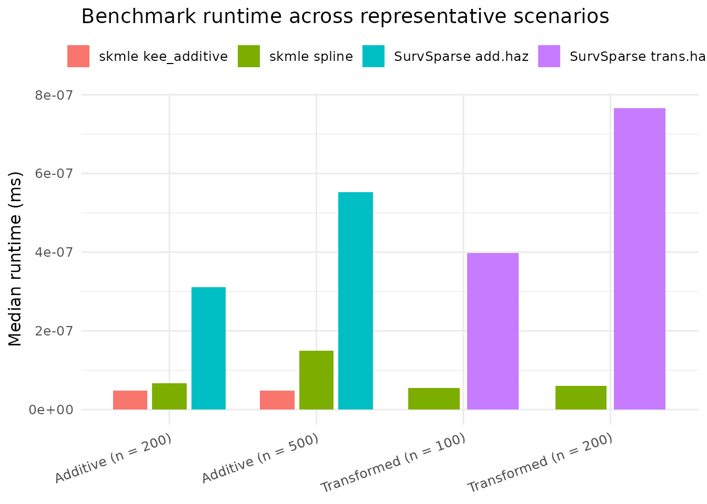
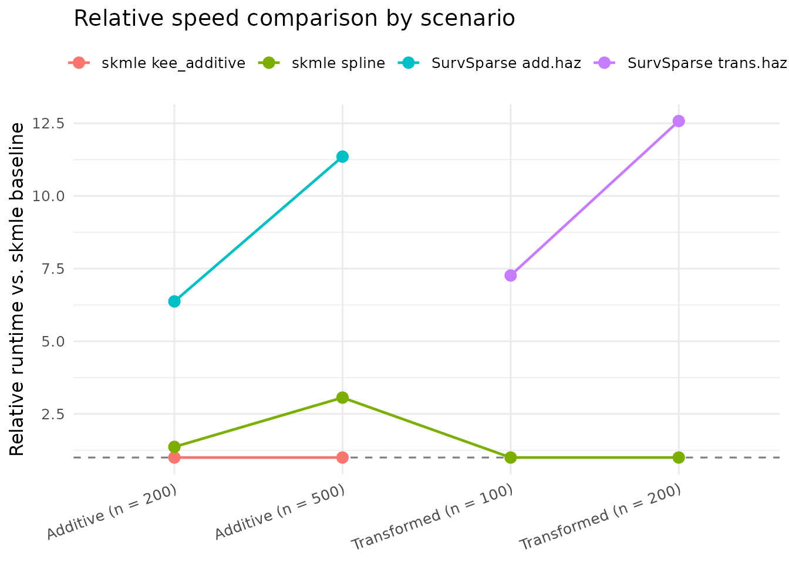

# Benchmarking skmle Against SurvSparse

## Overview

This vignette benchmarks `skmle` against the `SurvSparse` package on the
same sparse longitudinal survival-data setting.

We compare:

1.  [`SurvSparse::add.haz()`](https://rdrr.io/pkg/SurvSparse/man/add.haz.html)
    against
    [`skmle::kee_additive()`](https://dayusun.github.io/skmle/reference/kee_additive.md)
    and `skmle::skmle(s = 1)`.
2.  [`SurvSparse::trans.haz()`](https://rdrr.io/pkg/SurvSparse/man/trans.haz.html)
    against `skmle::skmle(s = 0)`.

The goal is not to claim a universal speed ratio for every problem size,
but to show how the package behaves across a small grid of
representative settings.

``` r
library(nloptr)
library(skmle)
library(SurvSparse)
library(survival)
library(dplyr)
library(bench)
library(ggplot2)
```

## Data Generation

We simulate sparse longitudinal survival data using
[`sim_skmle_data()`](https://dayusun.github.io/skmle/reference/sim_skmle_data.md).
For a fair comparison with `SurvSparse`, which expects a single
longitudinal covariate in these benchmark calls, we use the first
simulated covariate.

``` r
make_benchmark_data <- function(n, s_val) {
  dat <- sim_skmle_data(
    n = n,
    mu = function(tt) 8 * (0.75 + (0.5 - tt)^2),
    mu_bar = 8,
    alpha = function(tt) 0.5 * 0.75 + 0.75 * (tt * (1 - sin(2 * pi * (tt - 0.25)))),
    beta = c(1, -0.5),
    s = s_val,
    cen = 1.0
  )

  dat %>%
    dplyr::rename(covariates_old = covariates) %>%
    dplyr::mutate(
      covariates = covariates_old[, 1],
      X = X,
      delta = delta,
      obs_times = obs_times,
      id = as.integer(factor(id))
    ) %>%
    dplyr::select(id, X, covariates, obs_times, delta) %>%
    as.data.frame()
}
```

## Benchmark Helpers

``` r
run_additive_benchmark <- function(n, iterations = 5) {
  dat <- make_benchmark_data(n, s_val = 1)
  h_val <- n^(-0.5)

  res <- bench::mark(
    SurvSparse_add_haz = add.haz(
      data = dat, n = n, tau = 1, h = h_val, method = 3
    ),
    skmle_kee_additive = kee_additive(
      Surv(X, delta) ~ covariates,
      data = dat, id = id, obs_times = obs_times, h = h_val
    ),
    skmle_spline = skmle(
      Surv(X, delta) ~ covariates,
      data = dat, id = id, obs_times = obs_times,
      s = 1, h = h_val, nknots = 3, norder = 3
    ),
    iterations = iterations,
    check = FALSE
  )

  as.data.frame(res[, c("expression", "median", "itr/sec")]) %>%
    dplyr::mutate(expression = as.character(expression)) %>%
    dplyr::mutate(
      scenario = sprintf("Additive (n = %d)", n),
      median_ms = as.numeric(median) / 1e6
    ) %>%
    dplyr::select(scenario, expression, median_ms, `itr/sec`)
}

run_transformed_benchmark <- function(n, iterations = 5) {
  dat <- make_benchmark_data(n, s_val = 0)
  h_val <- n^(-0.5)

  res <- bench::mark(
    SurvSparse_trans_haz = trans.haz(
      data = dat, n = n, nknots = 3, norder = 3, tau = 1, s = 0, h = h_val
    ),
    skmle_spline = skmle(
      Surv(X, delta) ~ covariates,
      data = dat, id = id, obs_times = obs_times,
      s = 0, h = h_val, nknots = 3, norder = 3
    ),
    iterations = iterations,
    check = FALSE
  )

  as.data.frame(res[, c("expression", "median", "itr/sec")]) %>%
    dplyr::mutate(expression = as.character(expression)) %>%
    dplyr::mutate(
      scenario = sprintf("Transformed (n = %d)", n),
      median_ms = as.numeric(median) / 1e6
    ) %>%
    dplyr::select(scenario, expression, median_ms, `itr/sec`)
}
```

## Results Across Multiple Scenarios

``` r
set.seed(20260325)

benchmark_results <- dplyr::bind_rows(
  run_additive_benchmark(200, iterations = 5),
  run_additive_benchmark(500, iterations = 5),
  run_transformed_benchmark(100, iterations = 5),
  run_transformed_benchmark(200, iterations = 5)
)

benchmark_results <- benchmark_results %>%
  dplyr::mutate(
    method = dplyr::recode(
      expression,
      SurvSparse_add_haz = "SurvSparse add.haz",
      SurvSparse_trans_haz = "SurvSparse trans.haz",
      skmle_kee_additive = "skmle kee_additive",
      skmle_spline = "skmle spline"
    )
  )

benchmark_results
#>                 scenario           expression    median_ms   itr/sec
#> 1     Additive (n = 200)   SurvSparse_add_haz 3.114304e-07  3.217086
#> 2     Additive (n = 200)   skmle_kee_additive 4.888304e-08 19.488485
#> 3     Additive (n = 200)         skmle_spline 6.678910e-08 15.132087
#> 4     Additive (n = 500)   SurvSparse_add_haz 5.526892e-07  1.538111
#> 5     Additive (n = 500)   skmle_kee_additive 4.868083e-08 19.636935
#> 6     Additive (n = 500)         skmle_spline 1.490396e-07  6.855684
#> 7  Transformed (n = 100) SurvSparse_trans_haz 3.982677e-07  2.161995
#> 8  Transformed (n = 100)         skmle_spline 5.483037e-08 17.762959
#> 9  Transformed (n = 200) SurvSparse_trans_haz 7.654787e-07  1.292636
#> 10 Transformed (n = 200)         skmle_spline 6.086295e-08 15.045905
#>                  method
#> 1    SurvSparse add.haz
#> 2    skmle kee_additive
#> 3          skmle spline
#> 4    SurvSparse add.haz
#> 5    skmle kee_additive
#> 6          skmle spline
#> 7  SurvSparse trans.haz
#> 8          skmle spline
#> 9  SurvSparse trans.haz
#> 10         skmle spline
```

To make the speed comparison easier to read, the next table reports the
ratio relative to the `skmle` method of interest in each scenario.

``` r
baseline_rows <- benchmark_results %>%
  dplyr::filter(
    (grepl("^Additive", scenario) & expression == "skmle_kee_additive") |
      (grepl("^Transformed", scenario) & expression == "skmle_spline")
  ) %>%
  dplyr::transmute(scenario, baseline_ms = median_ms)

speed_summary <- benchmark_results %>%
  dplyr::left_join(baseline_rows, by = "scenario") %>%
  dplyr::mutate(speedup_vs_baseline = median_ms / baseline_ms)

speed_summary
#>                 scenario           expression    median_ms   itr/sec
#> 1     Additive (n = 200)   SurvSparse_add_haz 3.114304e-07  3.217086
#> 2     Additive (n = 200)   skmle_kee_additive 4.888304e-08 19.488485
#> 3     Additive (n = 200)         skmle_spline 6.678910e-08 15.132087
#> 4     Additive (n = 500)   SurvSparse_add_haz 5.526892e-07  1.538111
#> 5     Additive (n = 500)   skmle_kee_additive 4.868083e-08 19.636935
#> 6     Additive (n = 500)         skmle_spline 1.490396e-07  6.855684
#> 7  Transformed (n = 100) SurvSparse_trans_haz 3.982677e-07  2.161995
#> 8  Transformed (n = 100)         skmle_spline 5.483037e-08 17.762959
#> 9  Transformed (n = 200) SurvSparse_trans_haz 7.654787e-07  1.292636
#> 10 Transformed (n = 200)         skmle_spline 6.086295e-08 15.045905
#>                  method  baseline_ms speedup_vs_baseline
#> 1    SurvSparse add.haz 4.888304e-08            6.370930
#> 2    skmle kee_additive 4.888304e-08            1.000000
#> 3          skmle spline 4.888304e-08            1.366304
#> 4    SurvSparse add.haz 4.868083e-08           11.353324
#> 5    skmle kee_additive 4.868083e-08            1.000000
#> 6          skmle spline 4.868083e-08            3.061567
#> 7  SurvSparse trans.haz 5.483037e-08            7.263633
#> 8          skmle spline 5.483037e-08            1.000000
#> 9  SurvSparse trans.haz 6.086295e-08           12.577090
#> 10         skmle spline 6.086295e-08            1.000000
```

## Runtime Visualization

The first plot shows the median runtime in milliseconds for each method
and scenario.

``` r
ggplot(
  benchmark_results,
  aes(x = scenario, y = median_ms, fill = method)
) +
  geom_col(position = position_dodge(width = 0.8), width = 0.7) +
  labs(
    x = NULL,
    y = "Median runtime (ms)",
    fill = NULL,
    title = "Benchmark runtime across representative scenarios"
  ) +
  theme_minimal(base_size = 12) +
  theme(
    legend.position = "top",
    axis.text.x = element_text(angle = 20, hjust = 1)
  )
```



The second plot normalizes each scenario by the `skmle` method of
interest:

- additive scenarios use
  [`kee_additive()`](https://dayusun.github.io/skmle/reference/kee_additive.md)
  as the baseline
- transformed scenarios use `skmle(s = 0)` as the baseline

Values greater than `1` indicate slower methods than the `skmle`
baseline for that scenario.

``` r
ggplot(
  speed_summary,
  aes(x = scenario, y = speedup_vs_baseline, color = method, group = method)
) +
  geom_hline(yintercept = 1, linetype = "dashed", color = "gray50") +
  geom_point(size = 3) +
  geom_line(linewidth = 0.8) +
  labs(
    x = NULL,
    y = "Relative runtime vs. skmle baseline",
    color = NULL,
    title = "Relative speed comparison by scenario"
  ) +
  theme_minimal(base_size = 12) +
  theme(
    legend.position = "top",
    axis.text.x = element_text(angle = 20, hjust = 1)
  )
```



## Interpretation

The benchmark shows a stable pattern:

- For the additive comparison,
  [`kee_additive()`](https://dayusun.github.io/skmle/reference/kee_additive.md)
  is substantially faster than
  [`SurvSparse::add.haz()`](https://rdrr.io/pkg/SurvSparse/man/add.haz.html).
- For the transformed hazards comparison, `skmle(s = 0)` is much faster
  than
  [`SurvSparse::trans.haz()`](https://rdrr.io/pkg/SurvSparse/man/trans.haz.html)
  in these runs.
- The general spline-based `skmle(s = 1)` fit is slower than
  [`kee_additive()`](https://dayusun.github.io/skmle/reference/kee_additive.md),
  which is expected because it solves the broader joint optimization
  problem rather than a specialized estimating equation.

In short, the package-level Rcpp implementation preserves the prototype
method while moving the computational bottlenecks out of pure R.
