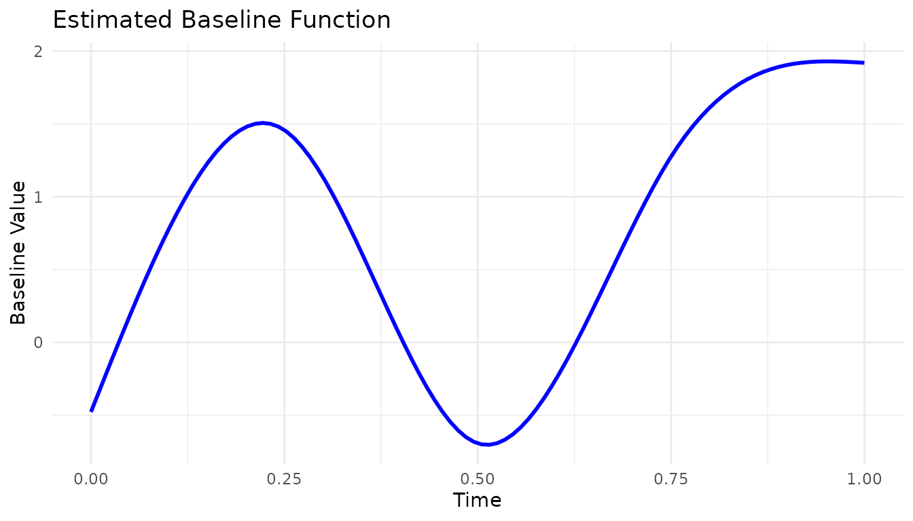

# Getting Started with skmle

## Overview

`skmle` fits transformed hazards survival models when longitudinal
covariates are observed sparsely and intermittently over time.

The package currently provides three main user-facing workflows:

1.  [`skmle()`](https://dayusun.github.io/skmle/reference/skmle.md) for
    the general transformed hazards model.
2.  [`kee_cox()`](https://dayusun.github.io/skmle/reference/kee_cox.md)
    for the proportional hazards estimating-equation approach.
3.  [`kee_additive()`](https://dayusun.github.io/skmle/reference/kee_additive.md)
    for the additive hazards estimating-equation approach.

This vignette shows the usual modeling workflow: simulate data, fit a
model, inspect the summary output, plot the estimated baseline
component, and select a bandwidth by cross-validation.

``` r
library(nloptr)
library(skmle)
library(survival)
```

## Simulate Example Data

``` r
set.seed(123)

dat <- sim_skmle_data(
  n = 80,
  mu = function(tt) 8 * (0.75 + (0.5 - tt)^2),
  mu_bar = 8,
  alpha = function(tt) 0.5 * 0.75 + 0.75 * (tt * (1 - sin(2 * pi * (tt - 0.25)))),
  beta = c(1, -0.5),
  s = 0,
  cen = 0.7
)

head(dat)
#> # A tibble: 6 × 6
#>   id        X delta covariates[,1]  [,2] obs_times censoring
#>   <chr> <dbl> <lgl>          <dbl> <dbl>     <dbl>     <dbl>
#> 1 1     0.805 TRUE         -0.714      0     0.129     0.930
#> 2 1     0.805 TRUE         -0.916      0     0.217     0.930
#> 3 1     0.805 TRUE         -0.916      0     0.247     0.930
#> 4 1     0.805 TRUE         -0.387      0     0.433     0.930
#> 5 1     0.805 TRUE         -0.0782     0     0.798     0.930
#> 6 2     0.504 TRUE          0.402      1     0.288     0.865
```

The simulated data are stored in long format. Each row corresponds to
one observed longitudinal measurement time for one subject.

The key columns are:

- `id`: subject identifier
- `X`: observed event or censoring time
- `delta`: event indicator
- `covariates`: observed covariate values at that visit time
- `obs_times`: longitudinal observation time

## Fit the General Transformed Hazards Model

The `covariates` column returned by
[`sim_skmle_data()`](https://dayusun.github.io/skmle/reference/sim_skmle_data.md)
is a matrix. You can either use it directly in the formula or split it
into separate columns. Using the matrix directly is convenient for
routine work.

``` r
fit_skmle <- skmle(
  Surv(X, delta) ~ covariates,
  data = dat,
  id = id,
  obs_times = obs_times,
  s = 0,
  h = 0.5,
  nknots = 3,
  norder = 3
)

fit_skmle
#> Call:
#> skmle(formula = Surv(X, delta) ~ covariates, data = dat, id = id, 
#>     obs_times = obs_times, s = 0, h = 0.5, nknots = 3, norder = 3)
#> 
#> Coefficients:
#> covariates1 covariates2 
#>   0.9215573  -0.5463503
```

The printed object gives the fitted coefficients. As in many R model
objects, the formatted inferential output is produced by
[`summary()`](https://rdrr.io/r/base/summary.html).

``` r
summary(fit_skmle)
#> Call:
#> skmle(formula = Surv(X, delta) ~ covariates, data = dat, id = id, 
#>     obs_times = obs_times, s = 0, h = 0.5, nknots = 3, norder = 3)
#> 
#>   n= 80
#> 
#>             Estimate Std. Error z value Pr(>|z|)   
#> covariates1  0.92156    0.31342  2.9403 0.003279 **
#> covariates2 -0.54635    0.34045 -1.6048 0.108543   
#> ---
#> Signif. codes:  0 '***' 0.001 '**' 0.01 '*' 0.05 '.' 0.1 ' ' 1
#> 
#> Log-likelihood: -0.0753
```

The summary table reports:

- coefficient estimates
- standard errors
- z statistics
- p-values

## Plot the Estimated Baseline Component

``` r
plot(fit_skmle)
```



This plot visualizes the estimated nonparametric baseline component from
the sieve fit.

## Fit the Specialized Estimating-Equation Methods

When the model of interest matches one of the specialized settings, the
package also provides dedicated estimating-equation estimators.

### Cox-Type Estimator

``` r
fit_kee_cox <- kee_cox(
  Surv(X, delta) ~ covariates,
  data = dat,
  id = id,
  obs_times = obs_times,
  h = 0.5
)

summary(fit_kee_cox)
#> Call:
#> kee_cox(formula = Surv(X, delta) ~ covariates, data = dat, id = id, 
#>     obs_times = obs_times, h = 0.5)
#> 
#>   n= 80
#> 
#>             Estimate Std. Error z value Pr(>|z|)   
#> covariates1  0.85832    0.29253  2.9341 0.003345 **
#> covariates2 -0.49833    0.34661 -1.4377 0.150516   
#> ---
#> Signif. codes:  0 '***' 0.001 '**' 0.01 '*' 0.05 '.' 0.1 ' ' 1
```

### Additive Hazards Estimator

For the additive hazards estimator, simulate data under `s = 1`.

``` r
set.seed(456)

dat_add <- sim_skmle_data(
  n = 80,
  mu = function(tt) 8 * (0.75 + (0.5 - tt)^2),
  mu_bar = 8,
  alpha = function(tt) 0.75 + 0.75 * (tt * (1 - sin(2 * pi * (tt - 0.25)))),
  beta = c(1, -0.5),
  s = 1,
  cen = 0.7
)

fit_kee_add <- kee_additive(
  Surv(X, delta) ~ covariates,
  data = dat_add,
  id = id,
  obs_times = obs_times,
  h = 0.5
)

summary(fit_kee_add)
#> Call:
#> kee_additive(formula = Surv(X, delta) ~ covariates, data = dat_add, 
#>     id = id, obs_times = obs_times, h = 0.5)
#> 
#>   n= 80
#> 
#>             Estimate Std. Error z value Pr(>|z|)  
#> covariates1  1.19769    0.52669  2.2740  0.02297 *
#> covariates2  0.26643    0.68259  0.3903  0.69630  
#> ---
#> Signif. codes:  0 '***' 0.001 '**' 0.01 '*' 0.05 '.' 0.1 ' ' 1
```

## Select a Bandwidth by Cross-Validation

Bandwidth selection can be handled by
[`skmle_cv()`](https://dayusun.github.io/skmle/reference/skmle_cv.md).

``` r
set.seed(999)

cv_fit <- skmle_cv(
  Surv(X, delta) ~ covariates,
  data = dat,
  id = id,
  obs_times = obs_times,
  s = 0,
  K = 3,
  h_grid = c(0.3, 0.4, 0.5),
  nknots = 3,
  norder = 3,
  quiet = TRUE
)

cv_fit$h_cv
#> [1] 0.3
cv_fit$cv_results
#>     h    cvloss
#> 1 0.3 0.5513460
#> 2 0.4 0.5858840
#> 3 0.5 0.6024361
```

The returned object contains:

- the selected bandwidth
- the refitted `skmle` model at that bandwidth
- the cross-validation loss table

You can then inspect the final refit in the usual way.

``` r
summary(cv_fit$fit)
#> Call:
#> skmle::skmle(formula = Surv(X, delta) ~ covariates, data = list(
#>     id = c("1", "1", "1", "1", "1", "2", "2", "2", "2", "2", 
#>     "3", "3", "3", "3", "3", "3", "4", "4", "4", "4", "4", "4", 
#>     "5", "5", "5", "5", "5", "5", "5", "5", "5", "5", "6", "6", 
#>     "6", "6", "6", "6", "6", "7", "7", "7", "7", "7", "7", "8", 
#>     "8", "8", "8", "8", "8", "8", "8", "8", "9", "9", "9", "10", 
#>     "10", "10", "11", "11", "11", "11", "11", "11", "12", "12", 
#>     "12", "12", "12", "12", "12", "13", "13", "13", "14", "14", 
#>     "14", "14", "14", "14", "15", "15", "15", "15", "15", "15", 
#>     "16", "16", "16", "16", "16", "16", "16", "16", "16", "16", 
#>     "17", "17", "17", "17", "17", "17", "17", "18", "18", "18", 
#>     "18", "18", "18", "19", "19", "19", "19", "19", "19", "19", 
#>     "20", "20", "20", "20", "20", "20", "20", "20", "20", "20", 
#>     "20", "21", "21", "21", "21", "21", "21", "21", "22", "22", 
#>     "22", "22", "22", "22", "22", "23", "23", "23", "23", "24", 
#>     "24", "24", "24", "24", "24", "25", "25", "25", "25", "25", 
#>     "25", "25", "25", "26", "26", "26", "26", "26", "26", "26", 
#>     "26", "26", "26", "26", "27", "27", "27", "28", "28", "28", 
#>     "28", "28", "28", "28", "28", "28", "29", "29", "29", "29", 
#>     "29", "29", "29", "29", "29", "29", "30", "30", "30", "30", 
#>     "30", "31", "31", "32", "32", "32", "32", "32", "32", "32", 
#>     "33", "33", "33", "33", "33", "33", "33", "33", "34", "34", 
#>     "34", "34", "35", "35", "35", "35", "35", "35", "36", "36", 
#>     "36", "36", "36", "36", "36", "36", "37", "37", "38", "38", 
#>     "38", "38", "38", "38", "38", "39", "39", "39", "39", "39", 
#>     "39", "39", "39", "39", "39", "39", "39", "40", "40", "40", 
#>     "40", "40", "40", "40", "40", "41", "41", "42", "42", "42", 
#>     "42", "42", "43", "43", "43", "43", "43", "43", "44", "44", 
#>     "44", "44", "44", "45", "45", "45", "46", "46", "46", "46", 
#>     "46", "46", "46", "46", "47", "47", "47", "47", "47", "47", 
#>     "47", "47", "47", "48", "48", "48", "48", "48", "49", "49", 
#>     "49", "49", "49", "49", "49", "50", "50", "50", "50", "51", 
#>     "51", "51", "51", "51", "51", "52", "52", "52", "52", "53", 
#>     "53", "53", "53", "53", "53", "53", "54", "54", "54", "54", 
#>     "54", "54", "55", "55", "55", "55", "55", "56", "56", "56", 
#>     "56", "56", "56", "56", "57", "57", "57", "57", "57", "58", 
#>     "58", "58", "58", "59", "59", "60", "60", "60", "60", "60", 
#>     "60", "60", "60", "60", "60", "61", "61", "61", "61", "61", 
#>     "62", "62", "62", "63", "63", "63", "63", "63", "63", "64", 
#>     "64", "64", "64", "64", "65", "65", "65", "65", "66", "67", 
#>     "67", "67", "67", "68", "68", "68", "68", "68", "68", "69", 
#>     "69", "69", "69", "69", "69", "69", "70", "70", "70", "70", 
#>     "71", "71", "71", "71", "72", "72", "72", "73", "73", "73", 
#>     "73", "73", "73", "74", "74", "74", "75", "75", "75", "75", 
#>     "75", "75", "75", "75", "76", "76", "76", "76", "77", "77", 
#>     "77", "77", "77", "77", "78", "78", "78", "78", "79", "79", 
#>     "79", "79", "79", "79", "79", "80", "80", "80", "80", "80", 
#>     "80", "80"), X = c(0.80491925326083, 0.80491925326083, 0.80491925326083, 
#>     0.80491925326083, 0.80491925326083, 0.504244074883785, 0.504244074883785, 
#>     0.504244074883785, 0.504244074883785, 0.504244074883785, 
#>     0.806438454148417, 0.806438454148417, 0.806438454148417, 
#>     0.806438454148417, 0.806438454148417, 0.806438454148417, 
#>     0.760918738783431, 0.760918738783431, 0.760918738783431, 
#>     0.760918738783431, 0.760918738783431, 0.760918738783431, 
#>     0.0793171205526692, 0.0793171205526692, 0.0793171205526692, 
#>     0.0793171205526692, 0.0793171205526692, 0.0793171205526692, 
#>     0.0793171205526692, 0.0793171205526692, 0.0793171205526692, 
#>     0.0793171205526692, 0.75818100031472, 0.75818100031472, 0.75818100031472, 
#>     0.75818100031472, 0.75818100031472, 0.75818100031472, 0.75818100031472, 
#>     0.150481255137256, 0.150481255137256, 0.150481255137256, 
#>     0.150481255137256, 0.150481255137256, 0.150481255137256, 
#>     0.377688287953813, 0.377688287953813, 0.377688287953813, 
#>     0.377688287953813, 0.377688287953813, 0.377688287953813, 
#>     0.377688287953813, 0.377688287953813, 0.377688287953813, 
#>     0.0940115810524506, 0.0940115810524506, 0.0940115810524506, 
#>     0.291620958741678, 0.291620958741678, 0.291620958741678, 
#>     0.331669315052288, 0.331669315052288, 0.331669315052288, 
#>     0.331669315052288, 0.331669315052288, 0.331669315052288, 
#>     0.882528537332401, 0.882528537332401, 0.882528537332401, 
#>     0.882528537332401, 0.882528537332401, 0.882528537332401, 
#>     0.882528537332401, 0.0569818095836087, 0.0569818095836087, 
#>     0.0569818095836087, 0.149252204012306, 0.149252204012306, 
#>     0.149252204012306, 0.149252204012306, 0.149252204012306, 
#>     0.149252204012306, 0.891192504638287, 0.891192504638287, 
#>     0.891192504638287, 0.891192504638287, 0.891192504638287, 
#>     0.891192504638287, 0.862838951293267, 0.862838951293267, 
#>     0.862838951293267, 0.862838951293267, 0.862838951293267, 
#>     0.862838951293267, 0.862838951293267, 0.862838951293267, 
#>     0.862838951293267, 0.862838951293267, 0.216646053963181, 
#>     0.216646053963181, 0.216646053963181, 0.216646053963181, 
#>     0.216646053963181, 0.216646053963181, 0.216646053963181, 
#>     0.233990622390468, 0.233990622390468, 0.233990622390468, 
#>     0.233990622390468, 0.233990622390468, 0.233990622390468, 
#>     0.247851698601017, 0.247851698601017, 0.247851698601017, 
#>     0.247851698601017, 0.247851698601017, 0.247851698601017, 
#>     0.247851698601017, 0.289790278634518, 0.289790278634518, 
#>     0.289790278634518, 0.289790278634518, 0.289790278634518, 
#>     0.289790278634518, 0.289790278634518, 0.289790278634518, 
#>     0.289790278634518, 0.289790278634518, 0.289790278634518, 
#>     0.671307244937725, 0.671307244937725, 0.671307244937725, 
#>     0.671307244937725, 0.671307244937725, 0.671307244937725, 
#>     0.671307244937725, 0.165913696815415, 0.165913696815415, 
#>     0.165913696815415, 0.165913696815415, 0.165913696815415, 
#>     0.165913696815415, 0.165913696815415, 0.827637991312641, 
#>     0.827637991312641, 0.827637991312641, 0.827637991312641, 
#>     0.0630597160220595, 0.0630597160220595, 0.0630597160220595, 
#>     0.0630597160220595, 0.0630597160220595, 0.0630597160220595, 
#>     1, 1, 1, 1, 1, 1, 1, 1, 0.317375622368764, 0.317375622368764, 
#>     0.317375622368764, 0.317375622368764, 0.317375622368764, 
#>     0.317375622368764, 0.317375622368764, 0.317375622368764, 
#>     0.317375622368764, 0.317375622368764, 0.317375622368764, 
#>     0.905301466397941, 0.905301466397941, 0.905301466397941, 
#>     1, 1, 1, 1, 1, 1, 1, 1, 1, 0.275643682117335, 0.275643682117335, 
#>     0.275643682117335, 0.275643682117335, 0.275643682117335, 
#>     0.275643682117335, 0.275643682117335, 0.275643682117335, 
#>     0.275643682117335, 0.275643682117335, 0.308766794712459, 
#>     0.308766794712459, 0.308766794712459, 0.308766794712459, 
#>     0.308766794712459, 0.730031871236861, 0.730031871236861, 
#>     0.0280737631705793, 0.0280737631705793, 0.0280737631705793, 
#>     0.0280737631705793, 0.0280737631705793, 0.0280737631705793, 
#>     0.0280737631705793, 0.886134350414706, 0.886134350414706, 
#>     0.886134350414706, 0.886134350414706, 0.886134350414706, 
#>     0.886134350414706, 0.886134350414706, 0.886134350414706, 
#>     0.255301405061647, 0.255301405061647, 0.255301405061647, 
#>     0.255301405061647, 0.0622211577649526, 0.0622211577649526, 
#>     0.0622211577649526, 0.0622211577649526, 0.0622211577649526, 
#>     0.0622211577649526, 0.837349562767111, 0.837349562767111, 
#>     0.837349562767111, 0.837349562767111, 0.837349562767111, 
#>     0.837349562767111, 0.837349562767111, 0.837349562767111, 
#>     0.706973935291171, 0.706973935291171, 0.135002070069461, 
#>     0.135002070069461, 0.135002070069461, 0.135002070069461, 
#>     0.135002070069461, 0.135002070069461, 0.135002070069461, 
#>     0.0236159284430028, 0.0236159284430028, 0.0236159284430028, 
#>     0.0236159284430028, 0.0236159284430028, 0.0236159284430028, 
#>     0.0236159284430028, 0.0236159284430028, 0.0236159284430028, 
#>     0.0236159284430028, 0.0236159284430028, 0.0236159284430028, 
#>     1, 1, 1, 1, 1, 1, 1, 1, 0.787414306961, 0.787414306961, 0.641178890738329, 
#>     0.641178890738329, 0.641178890738329, 0.641178890738329, 
#>     0.641178890738329, 0.767338469269893, 0.767338469269893, 
#>     0.767338469269893, 0.767338469269893, 0.767338469269893, 
#>     0.767338469269893, 0.0356398941761609, 0.0356398941761609, 
#>     0.0356398941761609, 0.0356398941761609, 0.0356398941761609, 
#>     0.00169205580727334, 0.00169205580727334, 0.00169205580727334, 
#>     1, 1, 1, 1, 1, 1, 1, 1, 0.0907388997625328, 0.0907388997625328, 
#>     0.0907388997625328, 0.0907388997625328, 0.0907388997625328, 
#>     0.0907388997625328, 0.0907388997625328, 0.0907388997625328, 
#>     0.0907388997625328, 0.876359477731467, 0.876359477731467, 
#>     0.876359477731467, 0.876359477731467, 0.876359477731467, 
#>     0.795276687480509, 0.795276687480509, 0.795276687480509, 
#>     0.795276687480509, 0.795276687480509, 0.795276687480509, 
#>     0.795276687480509, 0.316211007827707, 0.316211007827707, 
#>     0.316211007827707, 0.316211007827707, 0.266043186648844, 
#>     0.266043186648844, 0.266043186648844, 0.266043186648844, 
#>     0.266043186648844, 0.266043186648844, 1, 1, 1, 1, 0.369115958352438, 
#>     0.369115958352438, 0.369115958352438, 0.369115958352438, 
#>     0.369115958352438, 0.369115958352438, 0.369115958352438, 
#>     0.65893189028121, 0.65893189028121, 0.65893189028121, 0.65893189028121, 
#>     0.65893189028121, 0.65893189028121, 0.787774489854219, 0.787774489854219, 
#>     0.787774489854219, 0.787774489854219, 0.787774489854219, 
#>     1, 1, 1, 1, 1, 1, 1, 0.45574479760058, 0.45574479760058, 
#>     0.45574479760058, 0.45574479760058, 0.45574479760058, 0.841695524007082, 
#>     0.841695524007082, 0.841695524007082, 0.841695524007082, 
#>     0.771352161514321, 0.771352161514321, 0.2030820828108, 0.2030820828108, 
#>     0.2030820828108, 0.2030820828108, 0.2030820828108, 0.2030820828108, 
#>     0.2030820828108, 0.2030820828108, 0.2030820828108, 0.2030820828108, 
#>     0.544482532965329, 0.544482532965329, 0.544482532965329, 
#>     0.544482532965329, 0.544482532965329, 0.820858762226999, 
#>     0.820858762226999, 0.820858762226999, 0.159374287085848, 
#>     0.159374287085848, 0.159374287085848, 0.159374287085848, 
#>     0.159374287085848, 0.159374287085848, 0.737421376258135, 
#>     0.737421376258135, 0.737421376258135, 0.737421376258135, 
#>     0.737421376258135, 0.850146153569221, 0.850146153569221, 
#>     0.850146153569221, 0.850146153569221, 0.285364606366961, 
#>     0.218931623590473, 0.218931623590473, 0.218931623590473, 
#>     0.218931623590473, 0.848587122242716, 0.848587122242716, 
#>     0.848587122242716, 0.848587122242716, 0.848587122242716, 
#>     0.848587122242716, 0.370391391135955, 0.370391391135955, 
#>     0.370391391135955, 0.370391391135955, 0.370391391135955, 
#>     0.370391391135955, 0.370391391135955, 0.7387859871611, 0.7387859871611, 
#>     0.7387859871611, 0.7387859871611, 0.127250637902534, 0.127250637902534, 
#>     0.127250637902534, 0.127250637902534, 0.22519839693758, 0.22519839693758, 
#>     0.22519839693758, 0.826282155654143, 0.826282155654143, 0.826282155654143, 
#>     0.826282155654143, 0.826282155654143, 0.826282155654143, 
#>     0.069988404879557, 0.069988404879557, 0.069988404879557, 
#>     1, 1, 1, 1, 1, 1, 1, 1, 0.234870145295065, 0.234870145295065, 
#>     0.234870145295065, 0.234870145295065, 0.155620288341497, 
#>     0.155620288341497, 0.155620288341497, 0.155620288341497, 
#>     0.155620288341497, 0.155620288341497, 0.652830019974493, 
#>     0.652830019974493, 0.652830019974493, 0.652830019974493, 
#>     0.47782128755272, 0.47782128755272, 0.47782128755272, 0.47782128755272, 
#>     0.47782128755272, 0.47782128755272, 0.47782128755272, 0.824400610476732, 
#>     0.824400610476732, 0.824400610476732, 0.824400610476732, 
#>     0.824400610476732, 0.824400610476732, 0.824400610476732), 
#>     delta = c(TRUE, TRUE, TRUE, TRUE, TRUE, TRUE, TRUE, TRUE, 
#>     TRUE, TRUE, TRUE, TRUE, TRUE, TRUE, TRUE, TRUE, TRUE, TRUE, 
#>     TRUE, TRUE, TRUE, TRUE, TRUE, TRUE, TRUE, TRUE, TRUE, TRUE, 
#>     TRUE, TRUE, TRUE, TRUE, TRUE, TRUE, TRUE, TRUE, TRUE, TRUE, 
#>     TRUE, TRUE, TRUE, TRUE, TRUE, TRUE, TRUE, TRUE, TRUE, TRUE, 
#>     TRUE, TRUE, TRUE, TRUE, TRUE, TRUE, TRUE, TRUE, TRUE, TRUE, 
#>     TRUE, TRUE, TRUE, TRUE, TRUE, TRUE, TRUE, TRUE, TRUE, TRUE, 
#>     TRUE, TRUE, TRUE, TRUE, TRUE, TRUE, TRUE, TRUE, TRUE, TRUE, 
#>     TRUE, TRUE, TRUE, TRUE, TRUE, TRUE, TRUE, TRUE, TRUE, TRUE, 
#>     TRUE, TRUE, TRUE, TRUE, TRUE, TRUE, TRUE, TRUE, TRUE, TRUE, 
#>     TRUE, TRUE, TRUE, TRUE, TRUE, TRUE, TRUE, TRUE, TRUE, TRUE, 
#>     TRUE, TRUE, TRUE, TRUE, TRUE, TRUE, TRUE, TRUE, TRUE, TRUE, 
#>     TRUE, TRUE, TRUE, TRUE, TRUE, TRUE, TRUE, TRUE, TRUE, TRUE, 
#>     TRUE, TRUE, TRUE, TRUE, TRUE, TRUE, TRUE, TRUE, TRUE, TRUE, 
#>     TRUE, TRUE, TRUE, TRUE, TRUE, TRUE, TRUE, TRUE, TRUE, TRUE, 
#>     TRUE, TRUE, TRUE, TRUE, TRUE, FALSE, FALSE, FALSE, FALSE, 
#>     FALSE, FALSE, FALSE, FALSE, TRUE, TRUE, TRUE, TRUE, TRUE, 
#>     TRUE, TRUE, TRUE, TRUE, TRUE, TRUE, FALSE, FALSE, FALSE, 
#>     FALSE, FALSE, FALSE, FALSE, FALSE, FALSE, FALSE, FALSE, FALSE, 
#>     TRUE, TRUE, TRUE, TRUE, TRUE, TRUE, TRUE, TRUE, TRUE, TRUE, 
#>     TRUE, TRUE, TRUE, TRUE, TRUE, FALSE, FALSE, TRUE, TRUE, TRUE, 
#>     TRUE, TRUE, TRUE, TRUE, TRUE, TRUE, TRUE, TRUE, TRUE, TRUE, 
#>     TRUE, TRUE, TRUE, TRUE, TRUE, TRUE, TRUE, TRUE, TRUE, TRUE, 
#>     TRUE, TRUE, TRUE, TRUE, TRUE, TRUE, TRUE, TRUE, TRUE, TRUE, 
#>     FALSE, FALSE, TRUE, TRUE, TRUE, TRUE, TRUE, TRUE, TRUE, TRUE, 
#>     TRUE, TRUE, TRUE, TRUE, TRUE, TRUE, TRUE, TRUE, TRUE, TRUE, 
#>     TRUE, FALSE, FALSE, FALSE, FALSE, FALSE, FALSE, FALSE, FALSE, 
#>     FALSE, FALSE, TRUE, TRUE, TRUE, TRUE, TRUE, TRUE, TRUE, TRUE, 
#>     TRUE, TRUE, TRUE, TRUE, TRUE, TRUE, TRUE, TRUE, TRUE, TRUE, 
#>     TRUE, FALSE, FALSE, FALSE, FALSE, FALSE, FALSE, FALSE, FALSE, 
#>     TRUE, TRUE, TRUE, TRUE, TRUE, TRUE, TRUE, TRUE, TRUE, TRUE, 
#>     TRUE, TRUE, TRUE, TRUE, FALSE, FALSE, FALSE, FALSE, FALSE, 
#>     FALSE, FALSE, TRUE, TRUE, TRUE, TRUE, TRUE, TRUE, TRUE, TRUE, 
#>     TRUE, TRUE, FALSE, FALSE, FALSE, FALSE, TRUE, TRUE, TRUE, 
#>     TRUE, TRUE, TRUE, TRUE, TRUE, TRUE, TRUE, TRUE, TRUE, TRUE, 
#>     TRUE, TRUE, TRUE, TRUE, TRUE, FALSE, FALSE, FALSE, FALSE, 
#>     FALSE, FALSE, FALSE, TRUE, TRUE, TRUE, TRUE, TRUE, FALSE, 
#>     FALSE, FALSE, FALSE, TRUE, TRUE, TRUE, TRUE, TRUE, TRUE, 
#>     TRUE, TRUE, TRUE, TRUE, TRUE, TRUE, TRUE, TRUE, TRUE, TRUE, 
#>     TRUE, FALSE, FALSE, FALSE, TRUE, TRUE, TRUE, TRUE, TRUE, 
#>     TRUE, FALSE, FALSE, FALSE, FALSE, FALSE, FALSE, FALSE, FALSE, 
#>     FALSE, TRUE, TRUE, TRUE, TRUE, TRUE, TRUE, TRUE, TRUE, TRUE, 
#>     TRUE, TRUE, TRUE, TRUE, TRUE, TRUE, TRUE, TRUE, TRUE, FALSE, 
#>     FALSE, FALSE, FALSE, TRUE, TRUE, TRUE, TRUE, TRUE, TRUE, 
#>     TRUE, TRUE, TRUE, TRUE, TRUE, TRUE, TRUE, TRUE, TRUE, TRUE, 
#>     FALSE, FALSE, FALSE, FALSE, FALSE, FALSE, FALSE, FALSE, TRUE, 
#>     TRUE, TRUE, TRUE, TRUE, TRUE, TRUE, TRUE, TRUE, TRUE, TRUE, 
#>     TRUE, TRUE, TRUE, TRUE, TRUE, TRUE, TRUE, TRUE, TRUE, TRUE, 
#>     FALSE, FALSE, FALSE, FALSE, FALSE, FALSE, FALSE), covariates = c(-0.713999635530183, 
#>     -0.916182957978765, -0.916182957978765, -0.386753432931914, 
#>     -0.0782057376259345, 0.402383703740286, 0.598857535295644, 
#>     0.598857535295644, 0.793069127251573, 0.793069127251573, 
#>     0.499259436503272, 0.199061704893576, 0.199061704893576, 
#>     0.199061704893576, 0.766885431666163, 0.766885431666163, 
#>     0.389262060395993, -0.555564017602704, -0.47332953089004, 
#>     -0.376750606630449, -0.320947137489768, -0.0374913231371825, 
#>     0.951588575875865, 0.951588575875865, 0.951588575875865, 
#>     0.951588575875865, 0.895943570457717, 0.826989935384498, 
#>     0.784184810390463, 0.897612666147256, 0.8894607993768, 0.853530127538144, 
#>     0.61078418101509, 0.84232133709133, 0.428253732881979, 0.510360860844542, 
#>     0.843857321421264, 0.473794650455627, 0.473794650455627, 
#>     0.439164875834021, 0.0813325559409641, -0.0726792853294861, 
#>     0.0226336105253424, 0.0226336105253424, -0.165822428412113, 
#>     0.78896020416773, 0.784738649064167, 0.751108597358972, 0.164355037699552, 
#>     -0.450841956423974, -0.316511236749207, 0.160784484840853, 
#>     0.293397929128993, 0.581527001889884, 0.773699575573401, 
#>     0.577434129751534, 0.939446708956678, -0.681597579088889, 
#>     -0.43707551264306, -0.443711549185011, -0.73343215701943, 
#>     -0.493847804653513, -0.488244561766877, -0.249744066789293, 
#>     -0.179784475963982, -0.738874487438153, -0.723549457607442, 
#>     -0.561344627654748, -0.616726879889217, -0.894918719527936, 
#>     -0.717959386157968, -0.686913571027284, -0.430329009542704, 
#>     0.811670747747983, 0.811670747747983, 0.475414264933376, 
#>     0.600064758516577, 0.757756647528064, 0.489289967633245, 
#>     0.474690663755303, 0.47817854555342, 0.596374778854591, 0.989847716289197, 
#>     0.935943554174415, 0.775023778637779, 0.641181921539593, 
#>     0.42073945175797, 0.428640442650728, 0.518956810516345, 0.181035205138172, 
#>     0.187076878677494, 0.0463681007459518, 0.0461724595408157, 
#>     0.325908998382954, -0.222405169070623, -0.222405169070623, 
#>     -0.222405169070623, -0.249168900356768, 0.970802159577042, 
#>     0.941320398495358, 0.871935056597355, 0.0131933600381673, 
#>     -0.311989607779271, 0.0214075772733149, 0.361947081336574, 
#>     0.907643216994019, 0.908180503849758, 0.893315981685323, 
#>     0.418493174236855, 0.224414511844647, 0.0553785322440938, 
#>     -0.0454009951863925, -0.0454009951863925, -0.348967360299212, 
#>     -0.348967360299212, -0.441938451922437, -0.361432740310228, 
#>     0.506869860644478, -0.297183819176707, -0.179392077335227, 
#>     -0.294663057014084, 0.0344536609433139, 0.0344536609433139, 
#>     -0.31880498923045, -0.0102870831058507, -0.101999953960962, 
#>     -0.118526304507434, -0.241029611168663, 0.354640643865527, 
#>     0.389755325965797, -0.371826237794637, -0.355457745714276, 
#>     -0.0439633601806689, 0.450359772847726, 0.593070348873389, 
#>     0.593070348873389, 0.627329957159346, 0.627329957159346, 
#>     0.710499769107248, 0.914744346573191, 0.914744346573191, 
#>     0.965896782166661, 0.953527220937199, 0.629342882148908, 
#>     0.398196630528804, 0.398196630528804, 0.282331585178513, 
#>     0.980127678329676, 0.861084895775401, 0.725612256692335, 
#>     0.927727095833829, 0.927727095833829, 0.8361337839703, 0.102556808325521, 
#>     0.102556808325521, 0.00880069251791116, 0.0246976848189435, 
#>     0.33100582492993, 0.20157919764993, -0.145632269171872, -0.145632269171872, 
#>     0.0642250473187145, -0.491973544272968, -0.191317887914692, 
#>     -0.0759629398371242, -0.22192466573122, -0.22192466573122, 
#>     -0.0812473367105914, 0.211100249714517, -0.197686674817869, 
#>     -0.513356559085821, -0.513356559085821, 0.312543002695372, 
#>     0.15812992805605, -0.705197850492087, -0.301391634215131, 
#>     -0.301391634215131, -0.144216548975582, -0.418430220719241, 
#>     -0.874469281838994, -0.867338454271458, -0.867338454271458, 
#>     -0.74186467054465, -0.341980616047972, -0.859515489117963, 
#>     -0.859515489117963, -0.760083541141241, -0.356543322727111, 
#>     -0.750139746141911, -0.68863293206198, -0.51163782892903, 
#>     -0.41901669445703, -0.114315925793167, -0.114315925793167, 
#>     -0.658901092267946, -0.659588026744798, -0.843846423236827, 
#>     -0.825806984790365, -0.797548281207724, -0.851200597332216, 
#>     -0.665877032024424, -0.878817283370557, -0.286817694600367, 
#>     -0.0843046684795155, -0.415294470801232, -0.415294470801232, 
#>     -0.415294470801232, -0.765519524500237, 0.289399120802902, 
#>     0.418619513661521, 0.250579945956012, -0.0689405932354589, 
#>     0.185203002275878, 0.185203002275878, 0.224978558021338, 
#>     0.70189193337415, -0.466324876273809, -0.41364345733712, 
#>     -0.404001138408811, -0.303445616075215, -0.943632453033336, 
#>     -0.791905162177508, -0.879076339645029, 0.0518438819550817, 
#>     -0.295711691107564, -0.295711691107564, -0.344437796246998, 
#>     -0.576701675037798, -0.576701675037798, -0.899054235135485, 
#>     -0.879581355773358, -0.819273495111319, -0.843167193431703, 
#>     -0.843167193431703, 0.861940254028494, -0.188284601142004, 
#>     -0.771694033384698, -0.381158751846276, -0.00954097425197253, 
#>     -0.00954097425197253, 0.400815926541755, 0.70441459214867, 
#>     0.395222595934523, 0.478092561071422, 0.0832289311613998, 
#>     0.0832289311613998, 0.170065895515199, -0.0202898749223166, 
#>     -0.0202898749223166, 0.565416480917798, 0.720634189905098, 
#>     0.790421840345321, 0.806434376952255, 0.806434376952255, 
#>     0.806434376952255, 0.585667608303849, 0.123974931163561, 
#>     0.149148387810638, 0.235631315274225, -0.160760729279521, 
#>     0.053458159081508, -0.219709353935163, -0.219709353935163, 
#>     -0.674120431104708, -0.7877664861043, -0.76936964499644, 
#>     -0.567963281441201, 0.0246046822896542, 0.0246046822896542, 
#>     -0.0768533422592285, 0.57884331413713, 0.517665397786035, 
#>     0.808083858371713, 0.743466266284144, 0.692659033826621, 
#>     0.969534726156529, 0.712471679221853, 0.562819574931097, 
#>     0.580547709591748, 0.180682797002221, 0.615371123629078, 
#>     0.926496205147306, 0.902027600743263, 0.880561465316385, 
#>     -0.946949790565579, -0.895018005196318, -0.895018005196318, 
#>     -0.841890235257449, -0.708835889494123, -0.818902379373804, 
#>     -0.966600111570863, -0.905104027078712, 0.099293792499207, 
#>     0.480710405379714, 0.423229121173143, 0.423229121173143, 
#>     0.518284712618774, -0.285831457412968, -0.285831457412968, 
#>     0.192495357522032, 0.00752030284021155, -0.398532833995761, 
#>     0.10490594550873, 0.0914117495178532, 0.480431133174211, 
#>     0.763246393019222, -0.63215605876319, -0.424607755724246, 
#>     -0.734894205061475, -0.734894205061475, -0.874383903201096, 
#>     -0.903552846272384, -0.904454944531367, -0.728794543313094, 
#>     -0.391967017235652, -0.533882612847635, -0.945865389343483, 
#>     -0.150499941897816, 0.106160295060454, 0.0221158635499461, 
#>     0.0221158635499461, 0.599488492209213, 0.276102167884102, 
#>     -0.471650597237753, 0.00863669772527542, 0.00863669772527542, 
#>     0.398895125341547, -0.74146461497238, -0.74146461497238, 
#>     -0.893424527382718, -0.96389669039712, -0.51667432287083, 
#>     -0.634991819726325, -0.3705695884533, 0.660248254230025, 
#>     0.759780002567743, 0.895062945543875, 0.709470506051313, 
#>     0.605997193259966, 0.605997193259966, -0.919790089052124, 
#>     -0.801404097552676, -0.564741433868525, -0.564741433868525, 
#>     -0.316751367445731, -0.959633727462961, -0.52837754374558, 
#>     -0.52837754374558, -0.8234919519901, -0.845918896593335, 
#>     -0.683031672712775, -0.526795449457434, -0.69007406882432, 
#>     -0.539151293456372, -0.409928223850133, -0.0780710687383386, 
#>     -0.0780710687383386, -0.528446871513047, -0.489238000074994, 
#>     -0.518374248510328, -0.280622498193347, -0.780036674077918, 
#>     -0.716698453805599, -0.145833349440745, -0.124429166661591, 
#>     -0.124429166661591, -0.314257463909408, -0.371367311956585, 
#>     -0.743301380794188, -0.517790797759227, 0.162467321141287, 
#>     0.247324996723644, 0.378367994720729, -0.831306747112131, 
#>     -0.875526218194878, -0.919281696385789, -0.664259451566149, 
#>     -0.709407365964287, 0.13972769797471, 0.932913132089581, 
#>     0.891323243273689, 0.0556976756314418, 0.245481233881812, 
#>     0.641470794891577, 0.699539050691426, 0.659121388731664, 
#>     0.66386235293848, 0.706002741743592, 0.55059418747739, 0.0613841975727685, 
#>     -0.283860438924896, -0.3090426828291, 0.206230559480605, 
#>     -0.111759997304856, -0.0418837147424086, -0.333062263807068, 
#>     0.915013564320615, -0.0832093591776306, -0.0832093591776306, 
#>     -0.0832093591776306, 0.733061147864603, -0.441047123672094, 
#>     0.465288062866957, 0.546986087169432, 0.762245986043958, 
#>     0.762245986043958, 0.762245986043958, -0.75339621324936, 
#>     -0.75339621324936, -0.863853840414222, -0.895093673356594, 
#>     -0.554188423572485, -0.442710197105429, -0.456311714420473, 
#>     0.273520159087351, -0.0557563625689123, -0.0557563625689123, 
#>     0.229011733778913, 0.578277346926187, 0.758455021963517, 
#>     0.767863336962057, 0.118515095930071, -0.526012271788615, 
#>     -0.269510297097721, -0.147229419997954, -0.761446714592184, 
#>     -0.761446714592184, -0.714333001798706, -0.56818937427998, 
#>     -0.56818937427998, -0.572823771765607, 0.841328041079473, 
#>     0.589327979736343, 0.590292503010493, -0.0500832452834451, 
#>     -0.153806527309575, -0.748990804119578, -0.748990804119578, 
#>     -0.530960109160576, -0.52914495779488, -0.52914495779488, 
#>     -0.551245568480693, 0.784873676128502, 0.784873676128502, 
#>     0.739068960985094, 0.512801198172478, 0.376135731954242, 
#>     0.444988139149424, 0.393938271561386, 0.452250756360534, 
#>     -0.694627260324737, -0.896646820805394, -0.401938864533659, 
#>     -0.462392388901672, -0.861185642674408, -0.654940632850161, 
#>     -0.644526722489891, -0.574232521865521, -0.583679927213194, 
#>     -0.747570867602327, -0.747570867602327, -0.939855934470963, 
#>     -0.949980978690995, 0.21810299004916, 0.21810299004916, 0.307251531194405, 
#>     -0.114065716941257, -0.114065716941257, -0.340317945298228, 
#>     -0.401571624027863, 0, 0, 0, 0, 0, 1, 1, 1, 1, 1, 1, 1, 1, 
#>     1, 1, 1, 0, 0, 0, 0, 0, 0, 0, 0, 0, 0, 0, 0, 0, 0, 0, 0, 
#>     1, 1, 1, 1, 1, 1, 1, 1, 1, 1, 1, 1, 1, 0, 0, 0, 0, 0, 0, 
#>     0, 0, 0, 1, 1, 1, 1, 1, 1, 0, 0, 0, 0, 0, 0, 0, 0, 0, 0, 
#>     0, 0, 0, 1, 1, 1, 1, 1, 1, 1, 1, 1, 1, 1, 1, 1, 1, 1, 0, 
#>     0, 0, 0, 0, 0, 0, 0, 0, 0, 0, 0, 0, 0, 0, 0, 0, 1, 1, 1, 
#>     1, 1, 1, 1, 1, 1, 1, 1, 1, 1, 0, 0, 0, 0, 0, 0, 0, 0, 0, 
#>     0, 0, 0, 0, 0, 0, 0, 0, 0, 1, 1, 1, 1, 1, 1, 1, 1, 1, 1, 
#>     1, 1, 1, 1, 1, 1, 1, 1, 1, 1, 1, 1, 1, 1, 1, 0, 0, 0, 0, 
#>     0, 0, 0, 0, 0, 0, 0, 0, 0, 0, 0, 0, 0, 0, 0, 0, 0, 0, 0, 
#>     0, 0, 0, 0, 0, 0, 0, 0, 0, 0, 1, 1, 1, 1, 1, 1, 1, 1, 1, 
#>     1, 1, 1, 1, 1, 1, 1, 1, 1, 1, 1, 1, 1, 1, 1, 1, 1, 0, 0, 
#>     0, 0, 0, 0, 1, 1, 1, 1, 1, 1, 1, 1, 0, 0, 1, 1, 1, 1, 1, 
#>     1, 1, 0, 0, 0, 0, 0, 0, 0, 0, 0, 0, 0, 0, 1, 1, 1, 1, 1, 
#>     1, 1, 1, 0, 0, 0, 0, 0, 0, 0, 0, 0, 0, 0, 0, 0, 0, 0, 0, 
#>     0, 0, 1, 1, 1, 0, 0, 0, 0, 0, 0, 0, 0, 0, 0, 0, 0, 0, 0, 
#>     0, 0, 0, 1, 1, 1, 1, 1, 0, 0, 0, 0, 0, 0, 0, 1, 1, 1, 1, 
#>     1, 1, 1, 1, 1, 1, 1, 1, 1, 1, 0, 0, 0, 0, 0, 0, 0, 1, 1, 
#>     1, 1, 1, 1, 0, 0, 0, 0, 0, 0, 0, 0, 0, 0, 0, 0, 0, 0, 0, 
#>     0, 0, 1, 1, 1, 1, 0, 0, 1, 1, 1, 1, 1, 1, 1, 1, 1, 1, 0, 
#>     0, 0, 0, 0, 1, 1, 1, 0, 0, 0, 0, 0, 0, 1, 1, 1, 1, 1, 0, 
#>     0, 0, 0, 1, 1, 1, 1, 1, 1, 1, 1, 1, 1, 1, 1, 1, 1, 1, 1, 
#>     1, 1, 1, 1, 1, 1, 0, 0, 0, 0, 0, 0, 0, 0, 0, 0, 0, 0, 0, 
#>     1, 1, 1, 1, 1, 1, 1, 1, 1, 1, 1, 1, 1, 1, 1, 0, 0, 0, 0, 
#>     0, 0, 0, 0, 0, 0, 0, 0, 0, 0, 0, 0, 0, 1, 1, 1, 1, 1, 1, 
#>     1), obs_times = c(0.129098247218248, 0.216736164356487, 0.247371050125567, 
#>     0.433373975908914, 0.797832974397977, 0.287967284844793, 
#>     0.417819280527262, 0.422760266629435, 0.770353370381457, 
#>     0.791194882407295, 0.21799066872336, 0.353904571849853, 0.355445380788296, 
#>     0.374713956611231, 0.502299563260749, 0.533687945455313, 
#>     0.0528439427725971, 0.282528330106288, 0.686375082004815, 
#>     0.728394428268075, 0.918857348151505, 0.961104793706909, 
#>     0.05462910910137, 0.0579585605300963, 0.0649282999802381, 
#>     0.0743845133110881, 0.137106081005186, 0.225886432919651, 
#>     0.297741782618687, 0.466472376836464, 0.670282039558515, 
#>     0.758593169506639, 0.136540197068825, 0.163070329232141, 
#>     0.323344993172213, 0.515071807894856, 0.621902295155451, 
#>     0.967469494324178, 0.985954165225849, 0.192023318726569, 
#>     0.276049672625959, 0.321725537767634, 0.478456383803859, 
#>     0.497948936186731, 0.950621264055371, 0.000465349061414599, 
#>     0.0939166070893407, 0.217243514023721, 0.427428280701861, 
#>     0.627146184444427, 0.662385506555438, 0.704872245667502, 
#>     0.755887259729207, 0.822030071169138, 0.348719493718818, 
#>     0.739031685516238, 0.829250823473558, 0.217929404358971, 
#>     0.450641819905102, 0.755826119434805, 0.0696103849967926, 
#>     0.296863555888685, 0.321976902256177, 0.57465485411697, 0.615645839648179, 
#>     0.684688232084096, 0.023144492181018, 0.260132473660633, 
#>     0.334587961202487, 0.546426258748397, 0.631788871716708, 
#>     0.844933539861813, 0.862399539677426, 0.203743813559413, 
#>     0.236339889001101, 0.513781139161438, 0.0402896158726875, 
#>     0.1134957706662, 0.240527505409728, 0.296175093376153, 0.566734495259633, 
#>     0.632116773186173, 0.0130410296842456, 0.16976905008778, 
#>     0.527394940610975, 0.67355498787947, 0.761985323159024, 0.860989357577637, 
#>     0.0236886432394385, 0.158688397612423, 0.20409588329494, 
#>     0.525974274147302, 0.596362960757688, 0.770622961455956, 
#>     0.869706070283428, 0.873151367530227, 0.886862571584061, 
#>     0.957669742405415, 0.108824073104188, 0.160184813430533, 
#>     0.273622734239325, 0.593866932671517, 0.64211381948553, 0.709579854737967, 
#>     0.829623878700659, 0.168327182616557, 0.236801022562442, 
#>     0.280410228906047, 0.641233131806786, 0.69627413520008, 0.707706519979448, 
#>     0.202184567693621, 0.244308249559253, 0.264485116582364, 
#>     0.299122775672004, 0.391228783410043, 0.568568754009902, 
#>     0.937770176911727, 0.00247881026007235, 0.0940013926010579, 
#>     0.134996398352087, 0.210523239802569, 0.216662138933316, 
#>     0.397246005246416, 0.547998871887103, 0.634896405041218, 
#>     0.679022809490561, 0.720050457865, 0.866189130349085, 0.0421280120499432, 
#>     0.190717455465347, 0.279283805051818, 0.510721075348556, 
#>     0.570713193388656, 0.801345300627872, 0.826690050307661, 
#>     0.0734143974259496, 0.0996219362132251, 0.136502299224958, 
#>     0.203785905148834, 0.236872595502064, 0.365980138303712, 
#>     0.846195757621899, 0.14877797709778, 0.179059559712186, 0.18390193884261, 
#>     0.585567104164511, 0.0993463299237192, 0.415722651407123, 
#>     0.465449363226071, 0.925272865919396, 0.932572785299271, 
#>     0.984083857620135, 0.0115217631682754, 0.0135306273587048, 
#>     0.419313521590084, 0.58214389719069, 0.746787912445143, 0.83073406224139, 
#>     0.991412194212899, 0.996445707278326, 0.0884845573455095, 
#>     0.22090977220796, 0.284614907577634, 0.318499490851536, 0.390331929083914, 
#>     0.395689367782325, 0.682575054233894, 0.792005731491372, 
#>     0.817117730388418, 0.969800120219588, 0.990168560296297, 
#>     0.424626225982766, 0.692171452676418, 0.770259348834122, 
#>     0.206487420713529, 0.223807222442701, 0.284895547432825, 
#>     0.328916536876932, 0.522414671257138, 0.617563133826479, 
#>     0.633436584845185, 0.656495965085924, 0.996371977264062, 
#>     0.00536444736644626, 0.00584710156545043, 0.135763919679448, 
#>     0.557101008715108, 0.782163587864488, 0.823743681889027, 
#>     0.852053971262649, 0.931066285818815, 0.968882349785417, 
#>     0.974454874172807, 0.266127483453602, 0.449270514305681, 
#>     0.480631644604728, 0.597377663478255, 0.689286037581041, 
#>     0.179660445340036, 0.269853502646864, 0.0726579503049268, 
#>     0.369978147351888, 0.42759138705903, 0.507285837298972, 0.516258012293578, 
#>     0.549954395460533, 0.94002635563539, 0.138030210509896, 0.165509229060262, 
#>     0.251174297416583, 0.415543700801209, 0.451247031800449, 
#>     0.464153463719413, 0.622946569696069, 0.857806453481317, 
#>     0.049625585321337, 0.0966202358249575, 0.162743138615042, 
#>     0.950890234904364, 0.13522967238918, 0.161366865616561, 0.22275191853027, 
#>     0.56940613792207, 0.66376400685083, 0.694694329071969, 0.0453361014369875, 
#>     0.153006548760459, 0.18632471258752, 0.436749597778544, 0.591200284194201, 
#>     0.745306309312582, 0.990072537912056, 0.996516271261498, 
#>     0.130337936155205, 0.604388989145552, 0.0501661477610469, 
#>     0.170270065078512, 0.359821268357337, 0.371063167229295, 
#>     0.437665002420545, 0.527599306078628, 0.896644064690918, 
#>     0.0733673155773431, 0.156350366072729, 0.169240613933653, 
#>     0.365405296906829, 0.460166618926451, 0.46473691239953, 0.566228931071237, 
#>     0.649938648333773, 0.77890710812062, 0.91014366876334, 0.921451541595161, 
#>     0.922061887802556, 0.0120903067290783, 0.100712787825614, 
#>     0.161467888858169, 0.312232244526967, 0.675000583287328, 
#>     0.735731156310067, 0.863605329301208, 0.866068027447909, 
#>     0.136625867811268, 0.297710746399766, 0.178849163930863, 
#>     0.377313619246706, 0.77073736069724, 0.77436368400231, 0.962715865811333, 
#>     0.143204428488389, 0.484661741182208, 0.564910990186036, 
#>     0.743281641742215, 0.761408725054935, 0.961905417498201, 
#>     0.0180689809385388, 0.219076051319756, 0.361041002920619, 
#>     0.501782032053517, 0.740052526888386, 0.0758486231788993, 
#>     0.441791965160519, 0.98560710856691, 0.118444304447621, 0.288494411157444, 
#>     0.290518567897379, 0.440440524602309, 0.46153046307154, 0.672314426861703, 
#>     0.732589497929439, 0.921618608292192, 0.0319623857784603, 
#>     0.0939928681158581, 0.278412915129618, 0.280268092164783, 
#>     0.378464790276555, 0.511671752504239, 0.517078383700905, 
#>     0.633375217550314, 0.711129917529455, 0.243547442136332, 
#>     0.608921787003055, 0.694451575400308, 0.915131913963705, 
#>     0.956250291550532, 0.0744089059749172, 0.161631000144293, 
#>     0.304607921961792, 0.30685532211252, 0.425684082999064, 0.451825619662711, 
#>     0.685755444204617, 0.205826920224354, 0.435208435403183, 
#>     0.680134959518909, 0.861947756260633, 0.172012803377584, 
#>     0.420889260945842, 0.717486052773893, 0.736150731099769, 
#>     0.841558005660772, 0.937291039619595, 0.146612475626171, 
#>     0.664355203974992, 0.677428116789088, 0.979523984715343, 
#>     0.0160918093752116, 0.0387414896395057, 0.187693298794329, 
#>     0.229440553346649, 0.511109673650935, 0.611147175775841, 
#>     0.823937889654189, 0.0547061813995242, 0.347608416806906, 
#>     0.497679084306583, 0.510326466523111, 0.815768377389759, 
#>     0.84894580161199, 0.0299566281028092, 0.0981186414137483, 
#>     0.165858007734641, 0.194150109542534, 0.829592596972361, 
#>     0.0708756730891764, 0.305234725121409, 0.319253370864317, 
#>     0.41733704158105, 0.652336813742295, 0.810096084838733, 0.916375945322216, 
#>     0.250050476510046, 0.536359749059303, 0.729475702884113, 
#>     0.779960195838242, 0.794141826741533, 0.333195846993136, 
#>     0.403126594980647, 0.647968436042821, 0.669080319444379, 
#>     0.435007651569322, 0.486201937077567, 0.0951889341231436, 
#>     0.137665323214605, 0.142759153386578, 0.19246097211726, 0.277967476984486, 
#>     0.494586978806183, 0.521848226897418, 0.731465178076178, 
#>     0.841216969070956, 0.94130395934917, 0.112209268612787, 0.421875875210389, 
#>     0.563311485340819, 0.932780175935477, 0.95624218787998, 0.0488323116420574, 
#>     0.519521422766883, 0.64420038813814, 0.0266316782217473, 
#>     0.312746818875894, 0.471819306723773, 0.71062245243229, 0.855137056205422, 
#>     0.992102828575298, 0.273629038734834, 0.346860754361587, 
#>     0.359104651999538, 0.620615777561682, 0.699930439502422, 
#>     0.359054692664775, 0.464990822965795, 0.618591379456209, 
#>     0.748569702732163, 0.332971109310165, 0.00833215420868406, 
#>     0.0329015170916066, 0.0349521704887068, 0.127814525469256, 
#>     0.201577648054808, 0.49846138083376, 0.670499595580623, 0.752462793607265, 
#>     0.766586359124631, 0.773862918838859, 0.0369292099494487, 
#>     0.0491153171751648, 0.518342392519116, 0.617076499853283, 
#>     0.743032434489578, 0.842428504256532, 0.893289207713678, 
#>     0.202239854980952, 0.502785153868041, 0.532708597578553, 
#>     0.612801802181382, 0.0549363414294938, 0.436196901094622, 
#>     0.589582994743902, 0.702869783294974, 0.0272933413304832, 
#>     0.592016844843357, 0.607036685485578, 0.654717127731918, 
#>     0.660978218422865, 0.704434575553713, 0.907993142802635, 
#>     0.911418842263936, 0.956864888591791, 0.0741794588976491, 
#>     0.24782083438857, 0.7447094368059, 0.143596600042656, 0.167980035534129, 
#>     0.542406288674101, 0.542835634667426, 0.651484300382435, 
#>     0.703151777619496, 0.733476307941601, 0.8988708013203, 0.167671811116766, 
#>     0.18603271886715, 0.227633608614071, 0.429536101130899, 0.0306510810988886, 
#>     0.130279129568472, 0.165227175957986, 0.360002009929165, 
#>     0.612492321541043, 0.758063732202045, 0.194727044552565, 
#>     0.392799434950575, 0.711240462260321, 0.835221615387127, 
#>     0.0610533128492534, 0.144771556835622, 0.631508268183097, 
#>     0.790799195878208, 0.796196335926652, 0.94152637058869, 0.955332809826359, 
#>     0.001412432039853, 0.00258296160088385, 0.283759710839097, 
#>     0.605011505407502, 0.635672326400184, 0.723613304578388, 
#>     0.783506779005328), censoring = c(0.930062016099691, 0.930062016099691, 
#>     0.930062016099691, 0.930062016099691, 0.930062016099691, 
#>     0.865225111693144, 0.865225111693144, 0.865225111693144, 
#>     0.865225111693144, 0.865225111693144, 1, 1, 1, 1, 1, 1, 1, 
#>     1, 1, 1, 1, 1, 1, 1, 1, 1, 1, 1, 1, 1, 1, 1, 1, 1, 1, 1, 
#>     1, 1, 1, 1, 1, 1, 1, 1, 1, 1, 1, 1, 1, 1, 1, 1, 1, 1, 1, 
#>     1, 1, 0.773315755836666, 0.773315755836666, 0.773315755836666, 
#>     0.770690640807152, 0.770690640807152, 0.770690640807152, 
#>     0.770690640807152, 0.770690640807152, 0.770690640807152, 
#>     1, 1, 1, 1, 1, 1, 1, 1, 1, 1, 0.815321852080524, 0.815321852080524, 
#>     0.815321852080524, 0.815321852080524, 0.815321852080524, 
#>     0.815321852080524, 1, 1, 1, 1, 1, 1, 1, 1, 1, 1, 1, 1, 1, 
#>     1, 1, 1, 1, 1, 1, 1, 1, 1, 1, 0.972747496142983, 0.972747496142983, 
#>     0.972747496142983, 0.972747496142983, 0.972747496142983, 
#>     0.972747496142983, 1, 1, 1, 1, 1, 1, 1, 1, 1, 1, 1, 1, 1, 
#>     1, 1, 1, 1, 1, 1, 1, 1, 1, 1, 1, 1, 1, 1, 1, 1, 1, 1, 1, 
#>     1, 1, 1, 1, 1, 1, 1, 1, 1, 1, 1, 1, 1, 1, 1, 1, 1, 1, 1, 
#>     1, 1, 1, 1, 1, 1, 1, 1, 1, 1, 0.905301466397941, 0.905301466397941, 
#>     0.905301466397941, 1, 1, 1, 1, 1, 1, 1, 1, 1, 1, 1, 1, 1, 
#>     1, 1, 1, 1, 1, 1, 1, 1, 1, 1, 1, 0.730031871236861, 0.730031871236861, 
#>     0.978113100863993, 0.978113100863993, 0.978113100863993, 
#>     0.978113100863993, 0.978113100863993, 0.978113100863993, 
#>     0.978113100863993, 1, 1, 1, 1, 1, 1, 1, 1, 1, 1, 1, 1, 0.7925327219069, 
#>     0.7925327219069, 0.7925327219069, 0.7925327219069, 0.7925327219069, 
#>     0.7925327219069, 1, 1, 1, 1, 1, 1, 1, 1, 0.706973935291171, 
#>     0.706973935291171, 1, 1, 1, 1, 1, 1, 1, 1, 1, 1, 1, 1, 1, 
#>     1, 1, 1, 1, 1, 1, 1, 1, 1, 1, 1, 1, 1, 1, 0.787414306961, 
#>     0.787414306961, 1, 1, 1, 1, 1, 1, 1, 1, 1, 1, 1, 0.783165600523353, 
#>     0.783165600523353, 0.783165600523353, 0.783165600523353, 
#>     0.783165600523353, 1, 1, 1, 1, 1, 1, 1, 1, 1, 1, 1, 0.719596788473427, 
#>     0.719596788473427, 0.719596788473427, 0.719596788473427, 
#>     0.719596788473427, 0.719596788473427, 0.719596788473427, 
#>     0.719596788473427, 0.719596788473427, 1, 1, 1, 1, 1, 0.795276687480509, 
#>     0.795276687480509, 0.795276687480509, 0.795276687480509, 
#>     0.795276687480509, 0.795276687480509, 0.795276687480509, 
#>     1, 1, 1, 1, 1, 1, 1, 1, 1, 1, 1, 1, 1, 1, 1, 1, 1, 1, 1, 
#>     1, 1, 1, 1, 1, 1, 1, 1, 1, 1, 1, 1, 1, 1, 1, 1, 1, 1, 1, 
#>     1, 0.867462399229407, 0.867462399229407, 0.867462399229407, 
#>     0.867462399229407, 0.867462399229407, 0.841695524007082, 
#>     0.841695524007082, 0.841695524007082, 0.841695524007082, 
#>     1, 1, 1, 1, 1, 1, 1, 1, 1, 1, 1, 1, 1, 1, 1, 1, 1, 0.820858762226999, 
#>     0.820858762226999, 0.820858762226999, 1, 1, 1, 1, 1, 1, 0.737421376258135, 
#>     0.737421376258135, 0.737421376258135, 0.737421376258135, 
#>     0.737421376258135, 0.850146153569221, 0.850146153569221, 
#>     0.850146153569221, 0.850146153569221, 1, 0.761263846978545, 
#>     0.761263846978545, 0.761263846978545, 0.761263846978545, 
#>     1, 1, 1, 1, 1, 1, 1, 1, 1, 1, 1, 1, 1, 0.7387859871611, 0.7387859871611, 
#>     0.7387859871611, 0.7387859871611, 0.909990219771862, 0.909990219771862, 
#>     0.909990219771862, 0.909990219771862, 0.738811728544533, 
#>     0.738811728544533, 0.738811728544533, 0.956921005807817, 
#>     0.956921005807817, 0.956921005807817, 0.956921005807817, 
#>     0.956921005807817, 0.956921005807817, 0.827900995314121, 
#>     0.827900995314121, 0.827900995314121, 1, 1, 1, 1, 1, 1, 1, 
#>     1, 0.826094675250351, 0.826094675250351, 0.826094675250351, 
#>     0.826094675250351, 0.827604608982801, 0.827604608982801, 
#>     0.827604608982801, 0.827604608982801, 0.827604608982801, 
#>     0.827604608982801, 1, 1, 1, 1, 1, 1, 1, 1, 1, 1, 1, 0.824400610476732, 
#>     0.824400610476732, 0.824400610476732, 0.824400610476732, 
#>     0.824400610476732, 0.824400610476732, 0.824400610476732)), 
#>     id = id, obs_times = obs_times, s = 0, h = 0.3, nknots = 3, 
#>     norder = 3)
#> 
#>   n= 80
#> 
#>             Estimate Std. Error z value Pr(>|z|)   
#> covariates1  1.06391    0.34671  3.0686 0.002151 **
#> covariates2 -0.53609    0.38391 -1.3964 0.162594   
#> ---
#> Signif. codes:  0 '***' 0.001 '**' 0.01 '*' 0.05 '.' 0.1 ' ' 1
#> 
#> Log-likelihood: 0.06305
```

## Typical Workflow

For routine use, the usual sequence is:

1.  Prepare data in long format with one row per observation time.
2.  Fit [`skmle()`](https://dayusun.github.io/skmle/reference/skmle.md)
    if you want the general transformed hazards model.
3.  Use [`summary()`](https://rdrr.io/r/base/summary.html) and
    [`plot()`](https://rdrr.io/r/graphics/plot.default.html) to inspect
    the fitted model.
4.  Use
    [`skmle_cv()`](https://dayusun.github.io/skmle/reference/skmle_cv.md)
    if you want data-driven bandwidth selection.
5.  Use
    [`kee_cox()`](https://dayusun.github.io/skmle/reference/kee_cox.md)
    or
    [`kee_additive()`](https://dayusun.github.io/skmle/reference/kee_additive.md)
    when the scientific model matches those specialized estimators.

This gives a standard R model-fitting interface while keeping the core
numerical work in the Rcpp backend.
